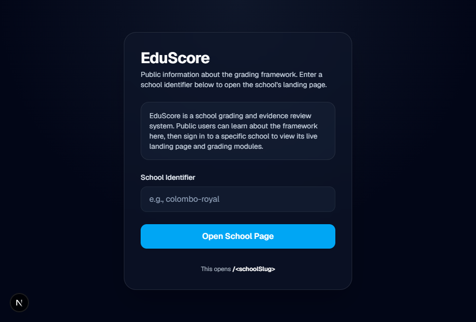
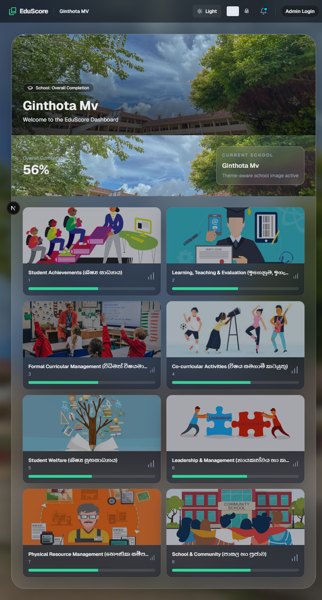
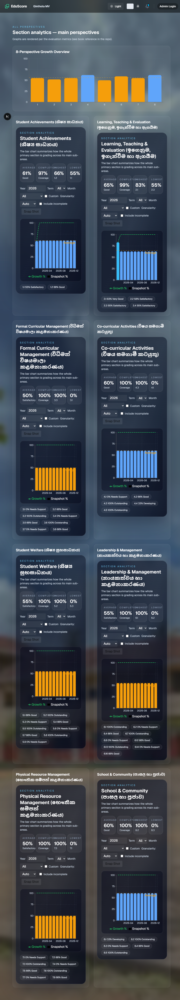
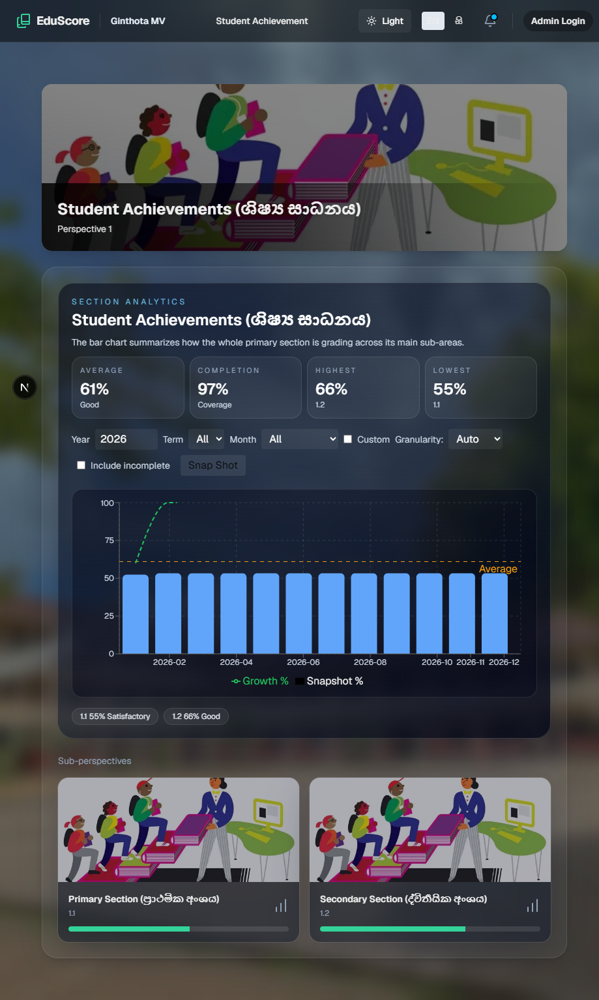
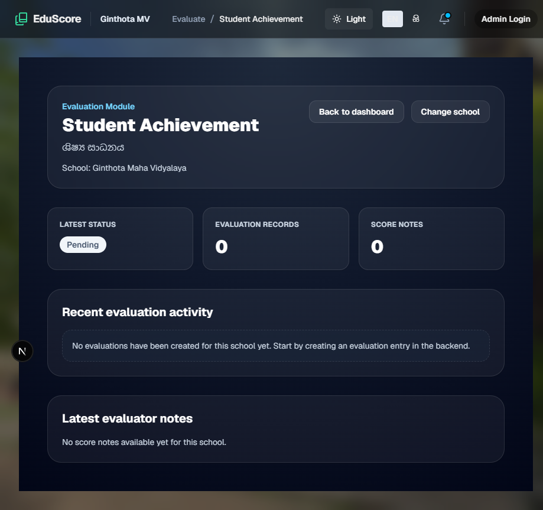
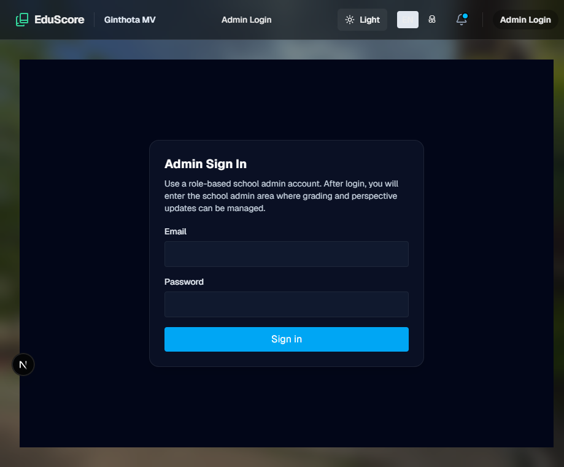

# EduScore — Full Project Report

**Generated:** July 22, 2026  
**Project Version:** 0.1.0  
**Status:** Active Development  
**Repository:** [github.com/AuravexonFlow/ede-score-1](https://github.com/AuravexonFlow/ede-score-1)

---

## 1. Executive Summary

EduScore is a **comprehensive school grading, evidence review, and quality assessment web application** aligned with the **Sri Lankan Ministry of Education's School Quality Standard (SQS) framework** (Process.pdf, 2014 edition). The system enables schools to submit evaluations across **8 quality perspectives** with a multi-tier approval workflow (Lead → VP → Principal), automated grading engine, bilingual support (English & Sinhala), and rich analytics dashboards.

| Attribute | Value |
|---|---|
| **Framework** | Next.js 16.2.4 (App Router + Turbopack) |
| **Language** | TypeScript 5 |
| **UI** | React 19.2.4, Tailwind CSS 4, Recharts, Lucide Icons |
| **Database** | Supabase (PostgreSQL) via `@supabase/ssr` + `@supabase/supabase-js` |
| **Auth** | Supabase Auth (primary), Firebase (secondary) |
| **Email** | Resend |
| **PDF** | `pdf-parse` |
| **Testing** | Node.js built-in test runner + `tsx` |
| **i18n** | English + Sinhala (සිංහල) |
| **Deployment** | Vercel / Firebase Hosting |

---

## 2. Screenshots

### 2.1 Homepage (Public)



The public homepage serves as the entry point. Users enter a school identifier (slug) to navigate to the school's landing page. Features a clean, dark-themed UI with radial gradient backgrounds and glass-morphism effects.

### 2.2 School Landing Page



The school-specific dashboard displays:
- **Hero section** with campus image and overall completion percentage (56%)
- **8 perspective cards** with images, bilingual titles (English + Sinhala), and progress indicators
- **Circular progress ring** showing overall school completion
- **Navigation bar** with breadcrumbs, theme toggle, language toggle, and admin login link

### 2.3 All Perspectives Dashboard



A comprehensive analytics view showing:
- **Bar chart** comparing all 8 perspectives with growth % and snapshot %
- **Per-perspective section metrics** with time-series charts
- **Period filters** (year, term, month, custom) and granularity controls
- **Legend** distinguishing growth vs. snapshot metrics

### 2.4 Single Perspective Detail



Individual perspective view (e.g., Student Achievements) showing:
- **Hero image** with perspective title and bilingual subtitle
- **Section analytics** with average score, completion %, highest/lowest sub-areas
- **Time-series chart** with growth and snapshot lines
- **Period controls** (year, term, month, granularity, custom range, include incomplete)
- **Sub-perspective cards** (e.g., Primary Section 1.1, Secondary Section 1.2)

### 2.5 Evaluation Module



Per-standard evaluation page featuring:
- **Standard header** with bilingual title and school name
- **Status indicator** (Pending/Approved/Finalized)
- **Evaluation records** count and score notes
- **Recent activity feed** and evaluator notes sections
- **Back to dashboard** and **Change school** navigation links

### 2.6 Admin Login



Secure admin authentication page with:
- Email/password sign-in form
- Role-based redirect after authentication
- Dark-themed glass-morphism card design

### 2.7 Dark Theme (School Page)


The school landing page in dark mode demonstrates the full theme system with:
- Deep slate gradients and glass-morphism cards
- Image overlays with opacity controls
- Responsive card grids with animated blob backgrounds

### 2.8 Sinhala Language View


Full bilingual support with Sinhala (සිංහල) translations for:
- Navigation items and breadcrumbs
- Perspective titles and descriptions
- UI labels and form elements
- Status text and notifications

---

## 3. Project Architecture

### 3.1 Technology Stack

#### Frontend
| Technology | Version | Purpose |
|---|---|---|
| Next.js | 16.2.4 | React framework with App Router + Turbopack |
| React | 19.2.4 | UI library |
| TypeScript | 5 | Type safety |
| Tailwind CSS | 4 | Utility-first CSS framework |
| Recharts | 3.8.1 | Charting library (bar, line, area, composed charts) |
| Lucide React | 1.8.0 | Icon library |

#### Backend & Database
| Technology | Purpose |
|---|---|
| Supabase (PostgreSQL) | Primary database with RLS policies |
| `@supabase/ssr` | Server-side rendering integration |
| `@supabase/supabase-js` | Browser-side database client |
| Firebase | Secondary auth provider |
| Resend | Transactional email service |

#### Development Tools
| Tool | Purpose |
|---|---|
| ESLint | Code linting |
| PostCSS | CSS processing |
| tsx | TypeScript execution for tests |
| Node.js test runner | Unit testing |

### 3.2 Project Structure

```
edu-score/
├── app/                              # Next.js App Router
│   ├── globals.css                   # Global styles (dark/light themes)
│   ├── layout.tsx                    # Root layout with providers
│   ├── page.tsx                      # Public homepage (school slug entry)
│   ├── [schoolSlug]/                 # School-specific routes
│   │   ├── layout.tsx                # School layout with Navbar
│   │   ├── page.tsx                  # School landing/dashboard
│   │   ├── dashboard/                # Redirects to /[schoolSlug]
│   │   ├── perspective/              # All perspectives analytics
│   │   │   └── [id]/                 # Single perspective detail
│   │   ├── evaluate/[standardId]/    # Per-standard evaluation
│   │   ├── report/                   # SQS Process Report
│   │   ├── admin/                    # School admin panel
│   │   │   └── report/               # Admin report with export
│   │   └── admin-login/              # Admin authentication
│   ├── api/                          # API Route Handlers
│   │   ├── submissions/              # CRUD for evaluations
│   │   ├── evaluations/[id]/transition/  # Status workflow
│   │   ├── grading/submit/           # Grading data submission
│   │   ├── perspective-evaluations/  # Fetch by perspective
│   │   ├── school-report/            # Full school report data
│   │   ├── notifications/            # User notifications
│   │   └── admin/                    # Admin operations
│   │       ├── users/                # User CRUD + role assignment
│   │       ├── user-management/      # Master-credential management
│   │       ├── recent-activities/    # Activity feed
│   │       ├── is-admin/             # Admin check
│   │       ├── audit/                # Audit log
│   │       ├── backfill-audit/       # Backfill audit data
│   │       ├── report/               # Report generation
│   │       ├── sidebar-assignments/  # Sidebar config
│   │       └── evaluations/          # Admin evaluations
│   ├── auth/                         # Auth gateway (role-based redirect)
│   ├── god-admin/                    # System admin dashboard
│   │   └── login/                    # God admin login
│   ├── reset-password/               # Password reset flow
│   └── backfill-audit/               # Audit view page
│
├── components/                       # React Components (30+)
│   ├── SchoolLandingClient.tsx       # School dashboard
│   ├── AllPerspectivesDashboard.tsx  # 8-perspective analytics
│   ├── PerspectivePageClient.tsx     # Single perspective view
│   ├── PerspectiveDetailClient.tsx   # Event/analysis detail
│   ├── SchoolAdminClient.tsx         # Admin panel
│   ├── SchoolReportClient.tsx        # Admin report + export
│   ├── ProcessReportClient.tsx       # SQS Process Report
│   ├── EvaluationForm.tsx            # Dynamic evaluation forms
│   ├── GodAdminUserManagement.tsx    # Confidential user CRUD
│   ├── PerspectiveAnalytics.tsx      # Time-series charts
│   ├── SectionMetricsPanel.tsx       # Per-perspective metrics
│   ├── SubmissionForm.tsx            # Evidence submission
│   ├── Navbar.tsx                    # Navigation with breadcrumbs
│   ├── Hero.tsx                      # Hero header component
│   ├── PerspectiveCard.tsx           # Perspective card with image
│   ├── CircularProgress.tsx          # SVG progress ring
│   ├── StatusBadge.tsx               # Color-coded status tags
│   ├── Modal.tsx                     # Modal dialog
│   ├── ThemeToggle.tsx               # Dark/Light mode toggle
│   ├── LanguageToggle.tsx            # EN/සි language switch
│   ├── LanguageProvider.tsx          # i18n React Context
│   ├── RoleAssignmentForm.tsx        # Role assignment UI
│   ├── PerspectiveToggle.tsx         # Event/Analytics toggle
│   ├── UserManagementTrigger.tsx     # Easter egg trigger
│   ├── FormInput.tsx                 # Styled input field
│   ├── MockSubmissionForm.tsx        # Mock form (testing)
│   ├── MockData.ts                   # 78 SQS perspectives data
│   └── utils/                        # Component utilities
│       ├── mockEventStore.ts         # localStorage event store
│       ├── qualityBands.ts           # 6-band quality scale
│       └── aggregation.ts            # Time-series aggregation
│
├── lib/                              # Core Libraries
│   ├── evaluationSchemas.ts          # SQS indicator definitions
│   ├── gradingEngine.ts              # Automated grading engine
│   └── i18n/translations.ts          # EN + SI translations
│
├── utils/                            # Utilities
│   ├── supabase/                     # Supabase clients (server/client/admin/middleware)
│   ├── firebase/client.ts            # Firebase initialization
│   ├── authorization.ts              # RBAC (11 roles, 3 statuses)
│   ├── submitter.ts                  # Seeded role map
│   ├── sidebarPermissions.ts         # Role → sidebar mapping
│   ├── statusNotify.ts               # In-app + email notifications
│   ├── rejection.ts                  # Rejection workflow
│   ├── recipients.ts                 # Email recipient resolution
│   ├── email.ts                      # Resend email templates
│   └── qualityPayload.ts             # Perspective One data serialization
│
├── supabase/                         # Database Migrations
│   └── migrations/                   # 6 migration files (001-006)
│
├── scripts/                          # Database & Utility Scripts
│   ├── seedRoles.js                  # Role seeding
│   ├── apply_migration.ps1           # Migration application
│   ├── backfillSubmitters.js         # Data backfill
│   ├── extract_pdf_text*.js          # PDF text extraction
│   └── various check/inspect scripts # Database inspection
│
├── tests/                            # Unit Tests
│   ├── aggregation.test.ts           # Time-series aggregation
│   └── qualityBands.test.ts          # Quality band calculation
│
└── public/                           # Static Assets
```

---

## 4. Complete Route Map

### 4.1 Public Routes

| Route | Description |
|---|---|
| `/` | **Public Hub** — School slug entry form with validation against `schools` table |
| `/auth` | **Auth Gateway** — Role-based redirect (GOD_ADMIN → `/god-admin`, signed-out → `/`) |
| `/reset-password` | **Password Reset** — Supabase recovery token handler (min 8 chars) |
| `/backfill-audit` | **Admin Audit View** — Tabular display of backfill audit data |

### 4.2 School Routes (`/[schoolSlug]/`)

| Route | Component | Description |
|---|---|---|
| `/[schoolSlug]` | `SchoolLandingClient` | School dashboard — hero, overall completion, 8 perspective cards |
| `/[schoolSlug]/perspective` | `AllPerspectivesDashboard` | All 8 perspectives analytics — bar chart, section metrics |
| `/[schoolSlug]/perspective/[id]` | `PerspectivePageClient` | Single perspective — hero, sub-cards, analytics, events |
| `/[schoolSlug]/evaluate/[standardId]` | Server Component | Per-standard evaluation — fetches data from Supabase |
| `/[schoolSlug]/report` | `ProcessReportClient` | SQS Process Report — criteria totals, field %, SEQI |
| `/[schoolSlug]/admin` | `SchoolAdminClient` | Admin panel — submissions, approvals, roles, attachments |
| `/[schoolSlug]/admin/report` | `SchoolReportClient` | Admin report — activities, status badges, PDF export |
| `/[schoolSlug]/admin-login` | Server Component | Admin login — Supabase email/password auth |

### 4.3 God Admin Routes

| Route | Description |
|---|---|
| `/god-admin` | **God Admin Dashboard** — Confidential user management (GOD_ADMIN or ADMIN role) |
| `/god-admin/login` | God Admin login page |

### 4.4 API Endpoints

| Endpoint | Method | Description |
|---|---|---|
| `POST /api/submissions` | POST | Create evaluation submission (file URLs, hosted dates) |
| `PATCH /api/evaluations/[id]/transition` | PATCH | Status transition (PENDING→VP_APPROVED→FINALIZED) |
| `POST /api/grading/submit` | POST | Submit grading data (requires `canApprove`) |
| `GET /api/perspective-evaluations` | GET | Fetch evaluations by school + perspective/indicator |
| `GET /api/school-report` | GET | Full school report data |
| `GET /api/notifications` | GET | User notifications for a school |
| `GET/PATCH /api/admin/users` | GET/PATCH | List/update users (profiles, roles) |
| `PATCH /api/admin/users/role` | PATCH | Assign role to user |
| `POST /api/admin/user-management` | POST | Master-credential user management with audit |
| `GET /api/admin/recent-activities` | GET | Recent evaluation activities |

---

## 5. Core Features

### 5.1 Multi-Perspective Evaluation System (SQS Framework)

The system evaluates schools across **8 quality perspectives** with **78 total perspectives/criteria**:

| # | Perspective | Sinhala | Top-Level ID | Key Sub-areas |
|---|---|---|---|---|
| 1 | **Student Achievements** | ශිෂ්‍ය සාධනය | 1 | Primary competencies, Grade 5 Scholarship, O/L & A/L results, term test marks (Grades 6-13), SBA progress |
| 2 | **Learning, Teaching & Evaluation** | ඉගෙනුම, ඉගැන්වීම හා ඇගයීම | 13 | Lesson planning, quality of teaching, assessment, teacher personality |
| 3 | **Formal Curricular Management** | විධිමත් විෂයමාලා කළමනාකරණය | 27 | National goals, primary learning, assessment process, resources, special needs |
| 4 | **Co-curricular Activities** | විෂය සමගාමී කටයුතු | 36 | Planning, primary programs, sports, creativity, ethics/values |
| 5 | **Student Welfare** | ශිෂ්‍ය සුභසාධනය | 43 | Counseling, attendance, health, sanitation, child protection |
| 6 | **Leadership & Management** | නායකත්වය හා කළමනාකරණය | 53 | Vision/mission, strategic planning, finance, staff development |
| 7 | **Physical Resource Management** | භෞතික සම්පත් කළමනාකරණය | 63 | Grounds, buildings, labs, library, IT |
| 8 | **School & Community** | පාසල හා ප්‍රජාව | 72 | Parental participation, community contribution, SDS |

### 5.2 Automated Grading Engine

Aligned with the Ministry of Education Process.pdf (2014):

| Function | Description |
|---|---|
| `percentageToBand()` | Universal mapping: ≥90→6(Excellent), ≥75→5, ≥60→4, ≥45→3, ≥25→2, <25→1 |
| `calculateIndicatorScore()` | Type-specific calculators (percentage-band, direct-rating, custom-1_2_2, custom-1_2_3, teacher-evaluation) |
| `calculateCriteriaTotal()` | Sums indicator scores per criteria, computes percentage vs max |
| `calculateFieldPercentage()` | Field-level percentage across all indicators |
| `calculateSEQI()` | School Education Quality Index (average of field percentages) |
| `seqiToOverallBand()` | SEQI→label mapping (≥80 Excellent, ≥77 Very Good, etc.) |

### 5.3 Role-Based Access Control (RBAC)

**11 Canonical Roles:**

| Role | Scope | Permissions |
|---|---|---|
| `PRINCIPAL` | School-wide | Final approval, all perspectives, user management |
| `VP_ACADEMIC` | Perspectives 1-4 | Approve evaluations, manage academic staff |
| `VP_ADMIN` | Perspectives 5-8 | Approve evaluations, manage admin staff |
| `LEAD_PERSPECTIVE_01`–`08` | Single perspective | Create/edit evaluations for assigned perspective |
| `GOD_ADMIN` | System-wide | Full access, user management, audit logs |

**3-Tier Approval Workflow:**
```
PENDING → VP_APPROVED → FINALIZED
    ↓
 REJECTED (with reason + notification)
```

### 5.4 Dynamic Evaluation Forms

Per-indicator custom forms supporting multiple field types:
- **Percentage** — Numeric input with automatic band calculation
- **Rating 1-6** — Direct rating scale
- **Grade Columns** — Multi-column grade entry
- **Teacher Marks** — 4 teachers × 1-6 marks with average calculation
- **Number** — Generic numeric input
- **Text** — Free text input
- **Readonly** — Display-only fields

### 5.5 Analytics & Dashboards

| Chart Type | Component | Description |
|---|---|---|
| Radar Chart | `PerformanceRadar` | Multi-axis performance comparison |
| Bar Chart | `AllPerspectivesDashboard` | 8-perspective growth comparison |
| Time-Series | `PerspectiveAnalytics` | Line/area/composed charts with period filters |
| Section Metrics | `SectionMetricsPanel` | Per-perspective bar charts with grade bands |
| Circular Progress | `CircularProgress` | SVG progress ring (red/yellow/green) |

**Time Period Controls:**
- Year, Term, Month filters
- Custom date ranges
- Granularity: Auto/Year/Term/Month/Week/Day
- Include incomplete option
- Snapshot mode

### 5.6 Notifications & Email

| Feature | Description |
|---|---|
| In-app notifications | Real-time notification bell with read/unread status |
| Email notifications | Via Resend with templates for: submitted, approved, finalized, rejected |
| Reviewer alerts | Auto-notify VP + Principal on new submissions |
| Override-to | Test mode: redirect all emails to a test address |

### 5.7 Evidence Submission

- File upload to Supabase Storage
- Attachment management in admin panel
- PDF text extraction via `pdf-parse`
- Hosted date tracking (from/to)

### 5.8 Internationalization (i18n)

| Feature | Description |
|---|---|
| Languages | English (`en`) + Sinhala (`si`) |
| Translation keys | 50+ keys covering UI labels, status text, form labels, errors, navigation |
| Auto-detection | Browser language detection on first visit |
| Persistence | localStorage + cookie for language preference |
| Component | `LanguageProvider` with `useI18n()` hook |

### 5.9 Theme System

| Mode | Description |
|---|---|
| **Dark** (`.dark`) | Deep slate gradients, glass-morphism cards, animated blobs |
| **Light** (`.inverted`) | White backgrounds, dark text, same glass effects |
| **Auto** | Detects `prefers-color-scheme` on first visit |

**Design Elements:**
- Radial gradient backgrounds
- Backdrop-blur glass-morphism
- Liquid glass gradient overlays
- Animated blob backgrounds
- 20+ CSS custom properties

### 5.10 God Admin Panel

- Confidential user CRUD (list, edit, reset passwords)
- Master credential fallback (`MASTER_ADMIN_EMAIL`/`MASTER_ADMIN_PASSWORD`)
- Audit logging for all admin activities
- Batch password reset capability
- Easter egg trigger: typing `aurabyravindu798` on keyboard opens modal globally

---

## 6. Database Schema

### 6.1 Core Tables (Pre-existing)

| Table | Key Columns | Description |
|---|---|---|
| `schools` | id, name, slug | School registry |
| `evaluations` | id, school_id, title, description, perspective_number, status, files, academic_year, term, submitter_id, evaluator_id | Evaluation records |
| `user_profiles` | id, full_name, roles TEXT[], school_id, email, assigned_sidebar_items | User profiles |
| `standards` | id, name_en, name_si | SQS standards |
| `scores` | id, evaluation_id, updated_at, notes | Evaluation scores |

### 6.2 Migration History

| Migration | Table/Column | Purpose |
|---|---|---|
| **001** | `admin_user_audit` | Audit trail (performed_by, target_user_id, action, details JSONB) |
| **002a** | `evaluations.hosted_from/to` | Hosted date range tracking |
| **002b** | `evaluations.submitter_role` | Role of the submitter |
| **003** | `evaluations` + `notifications` | Rejection workflow (rejection_reason, rejected_by, rejected_at) + notification system |
| **004** | `evaluations` | Edit history (previous_snapshot JSONB, edited_by, edited_at) |
| **005** | `user_profiles.assigned_sidebar_items` | Principal-assigned sidebar items per user |
| **006** | `evaluations` | Form data storage (form_data JSONB, indicator_code, score, completion) + indexes |

---

## 7. Component Inventory

### 7.1 Page/Container Components

| Component | Purpose |
|---|---|
| `SchoolLandingClient` | School dashboard — hero image, perspective cards, overall completion |
| `AllPerspectivesDashboard` | 8-perspective bar chart + per-perspective section metrics |
| `PerspectivePageClient` | Single perspective view with hero, sub-cards, analytics |
| `PerspectiveDetailClient` | Event list + analysis toggle, event viewer with attachments |
| `SchoolAdminClient` | Full admin panel: submissions, approvals, roles, attachments |
| `SchoolReportClient` | Admin report with activity list, status badges, PDF export |
| `ProcessReportClient` | SQS Process Report: criteria totals, field %, SEQI |
| `EvaluationForm` | Dynamic per-indicator evaluation form with auto-score |
| `GodAdminUserManagement` | Confidential user CRUD with audit logging |
| `PerspectiveAnalytics` | Time-series charts with period filters |
| `SectionMetricsPanel` | Per-perspective metrics with bar charts |

### 7.2 Form/Input Components

| Component | Purpose |
|---|---|
| `SubmissionForm` | Evidence submission with file upload |
| `MockSubmissionForm` | Mock version for testing |
| `FormInput` | Styled input field |
| `RoleAssignmentForm` | Admin role assignment UI |

### 7.3 UI/Display Components

| Component | Purpose |
|---|---|
| `Navbar` | Top navigation with breadcrumbs, logo, toggles, notifications |
| `Hero` | Generic hero header with image, title, subtitle |
| `PerspectiveCard` | Card with image, title, progress bar, click-to-navigate |
| `CircularProgress` | SVG circular progress ring (color-coded) |
| `StatusBadge` | Color-coded status tag (Approved/Pending/Needs Revision) |
| `Modal` | Generic modal dialog with backdrop blur |
| `PerspectiveToggle` | Toggle between Event View and Analytical Mode |

### 7.4 Theme/i18n Components

| Component | Purpose |
|---|---|
| `ThemeToggle` | Dark/Light mode toggle (persists to localStorage) |
| `LanguageToggle` | EN/සි language switch |
| `LanguageProvider` | React Context for i18n with `useI18n()` hook |

---

## 8. Utilities & Libraries

### 8.1 Supabase Clients

| File | Purpose |
|---|---|
| `utils/supabase/server.ts` | Server-side client with cookie-based session |
| `utils/supabase/client.ts` | Browser-side client (`createBrowserClient`) |
| `utils/supabase/admin.ts` | Service-role client (bypasses RLS) |
| `utils/supabase/middleware.ts` | Middleware client for session refresh |

### 8.2 Authorization

- **Roles**: PRINCIPAL, VP_ACADEMIC, VP_ADMIN, LEAD_PERSPECTIVE_01–08, GOD_ADMIN
- **Statuses**: PENDING, VP_APPROVED, FINALIZED
- **Key functions**: `getUserRole()`, `getUserRoles()`, `canCreateOrEdit()`, `canApprove()`, `canFinalize()`, `validateStatusTransition()`
- **Resolution**: app_metadata.roles → user_profiles.roles fallback chain

### 8.3 Other Utilities

| File | Purpose |
|---|---|
| `utils/submitter.ts` | Seeded role map (11 test accounts), canonical submitter ID/role |
| `utils/sidebarPermissions.ts` | 8 perspective titles (EN+SI), role→sidebar mapping |
| `utils/statusNotify.ts` | In-app + email notifications on approval/finalization |
| `utils/rejection.ts` | Rejection workflow (notification + email) |
| `utils/recipients.ts` | Email recipient resolution (seeded map → user_profiles → auth admin) |
| `utils/email.ts` | Resend integration with templates |
| `utils/qualityPayload.ts` | Perspective One quality data serialization |

---

## 9. Testing

| Test File | Purpose | Status |
|---|---|---|
| `tests/aggregation.test.ts` | Time-series aggregation logic | ✅ Passing |
| `tests/qualityBands.test.ts` | Quality band calculation | ✅ Passing |

**Run command:**
```bash
node --test --import tsx tests/aggregation.test.ts tests/qualityBands.test.ts
```

---

## 10. Scripts

| Script | Purpose |
|---|---|
| `seedRoles.js` | Seed 11 role-based test accounts for Ginthota MV |
| `apply_migration.ps1` | Apply Supabase migrations |
| `applyMigration006.js` | Apply migration 006 (form_data) |
| `backfillSubmitters.js` | Backfill submitter IDs on existing evaluations |
| `exportBackfillAudit.js` | Export backfill audit to CSV |
| `extract_pdf_text.js` | Extract text from PDF documents (pdf-parse) |
| `extract_pdf_text_pdfjs.js` | Extract text via pdf.js |
| `getSchools.js` | List all schools |
| `queryEvaluations.js` | Query evaluations data |
| `check_submitter_column.js` | Verify submitter column exists |
| `checkProfilesByEmail.js` | Check user profiles by email |
| `attach_notification_school.js` | Attach school_id to notifications |

---

## 11. Environment Variables

| Variable | Purpose | Required |
|---|---|---|
| `NEXT_PUBLIC_SUPABASE_URL` | Supabase project URL | ✅ |
| `NEXT_PUBLIC_SUPABASE_PUBLISHABLE_KEY` | Supabase anon/publishable key | ✅ |
| `SUPABASE_SERVICE_ROLE_KEY` | Supabase service role (admin operations) | ✅ |
| `RESEND_API_KEY` | Resend email API key | Optional |
| `EMAIL_FROM` | Sender email address | Optional |
| `EMAIL_OVERRIDE_TO` | Test mode: redirect all emails here | Optional |
| `EMAIL_ENABLED` | Enable/disable email (default: true) | Optional |
| `MASTER_ADMIN_EMAIL` | God Admin master email | Optional |
| `MASTER_ADMIN_PASSWORD` | God Admin master password | Optional |
| `NEXT_PUBLIC_MASTER_ADMIN_EMAIL` | Client-side master admin email | Optional |

---

## 12. Development Status

### ✅ Completed Features (Phase 1-3)

| Phase | Features | Status |
|---|---|---|
| **Phase 1: Navigation** | Navbar, breadcrumbs, logo, theme toggle, notifications, login link | ✅ Complete |
| **Phase 2: Dashboard** | Hero section, perspective cards with icons, circular progress rings | ✅ Complete |
| **Phase 3: Perspective View** | Contextual header, modal event form, color-coded status tags | ✅ Complete |
| **Post-Implementation** | Responsiveness review, mock data cleanup, final report | ✅ Complete |

### ✅ Fully Operational Features

1. Multi-tenant school system with slug-based routing
2. Complete SQS indicator framework (78 perspectives)
3. Dynamic evaluation forms (percentage, rating, grade-columns, teacher marks)
4. Automated grading engine (percentage→band, criteria totals, SEQI)
5. 3-tier approval workflow (PENDING → VP_APPROVED → FINALIZED)
6. Role-based access control (11 seeded accounts)
7. Evidence submission with file upload
8. In-app + email notifications via Resend
9. Analytics dashboards (radar, bar, time-series charts)
10. Bilingual UI (English + Sinhala)
11. Dark/Light themes with glass-morphism design
12. God Admin panel with confidential user management
13. Password reset flow via Supabase recovery tokens
14. Process report generation aligned with Ministry of Education

### ⚠️ Known Issues

| Issue | Severity | Description |
|---|---|---|
| Image `sizes` prop missing | Low | 8 perspective images need `sizes` prop for performance |
| LCP image missing `loading="eager"` | Low | School campus image detected as LCP without eager loading |
| Chart dimensions warning | Low | Recharts reports width/height -1 on initial render |
| Hydration mismatch (ThemeToggle) | Medium | Dark/Light toggle causes SSR/client mismatch on admin-login |
| Report page 500 error | Medium | `/report` returns 500 when Supabase is unavailable |

### 📝 Potential Enhancements

1. Enhanced reporting and export capabilities (PDF, Excel)
2. Real-time collaboration features
3. Mobile app development
4. Advanced analytics and predictive metrics
5. Integration with school management systems (EMIS)
6. Batch processing for large-scale evaluations
7. Custom perspective templates
8. Workflow automation
9. Add missing `sizes` props to Next.js Image components
10. Fix ThemeToggle hydration mismatch with `useEffect` pattern

---

## 13. Security Considerations

1. **Role-Based Access Control (RBAC)** — Enforced through Supabase RLS policies
2. **Audit Trail** — Admin activities logged in `admin_user_audit` table
3. **Database Migrations** — Structured database changes with version control
4. **Environment Variables** — Sensitive data stored securely in `.env.local`
5. **TypeScript** — Type safety reduces runtime errors
6. **Service Role Isolation** — Admin operations use separate service-role client
7. **Master Credential Pattern** — God Admin fallback with server-side validation

---

## 14. Performance Metrics

| Metric | Value | Notes |
|---|---|---|
| **Bundle Size** | Next.js optimized | Turbopack for fast dev builds |
| **Image Optimization** | Next.js Image component | Auto WebP/AVIF, lazy loading |
| **CSS Framework** | Tailwind CSS 4 | Purged unused styles |
| **Charting** | Recharts 3.8.1 | SVG-based, client-side rendering |
| **Database** | Supabase (PostgreSQL) | Connection pooling, RLS |

---

## 15. Deployment

### Development
```bash
npm install
npm run dev          # http://localhost:3000
```

### Production Build
```bash
npm run build
npm start
```

### Testing
```bash
npm test
```

### Linting
```bash
npm run lint
```

---

## 16. Repository Status

| Metric | Value |
|---|---|
| **GitHub** | [AuravexonFlow/ede-score-1](https://github.com/AuravexonFlow/ede-score-1) |
| **Latest Commit** | `f80282f` — Jun 12, 2026 — "Add production build and update translations" |
| **Contributors** | 2 (WRavindu, AuravexonFlow) |
| **Languages** | TypeScript 86.6%, JavaScript 8.8%, HTML 2.8%, CSS 1.1% |
| **Local Status** | 310 files modified after latest commit (ahead of GitHub) |

---

## 17. Contact & Support

- **Project README**: `README.md`
- **Supabase Docs**: https://supabase.com/docs
- **Next.js Docs**: https://nextjs.org/docs
- **Database Migrations**: `supabase/migrations/`
- **Project TODO**: `todo.md`

---

**Report Generated:** July 22, 2026  
**EduScore v0.1.0** — School Quality Standard Assessment Platform
